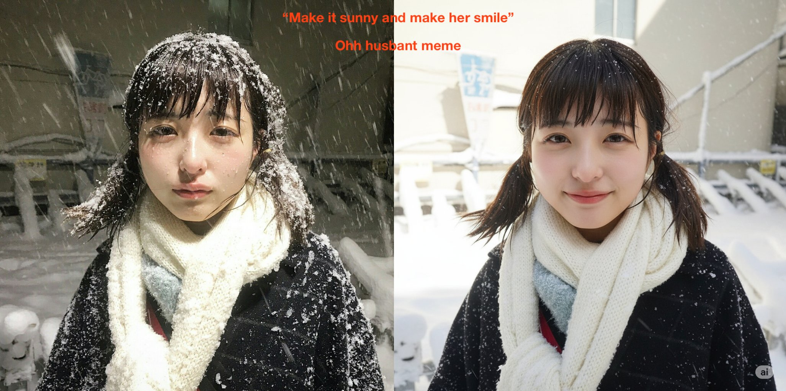

# awesome-nanobanana

这是一个收集 **Nano Banana** 使用案例的 Awesome 仓库，包含提示词、参考图和生成结果。Nano Banana 是一个先进的 AI 图像编辑模型，支持多图像输入、复杂指令和精确编辑。欢迎贡献！

## 目录
- [用例 1: 逐步编辑空房间](#用例-1-逐步编辑空房间)
- [用例 2: 添加自拍到背景](#用例-2-添加自拍到背景)
- [用例 3: Changing facial expressions and the weather](#用例-3-changing-facial-expressions-and-the-weather)
- [用例 4: 生成生日蛋糕图片](#用例-4-生成生日蛋糕图片)
- [用例 5: Complex scene transformation](#用例-5-complex-scene-transformation)
- [用例 6: 蓝图到飞机](#用例-6-蓝图到飞机)
- [用例 7: Giving bald men hair again](#用例-7-giving-bald-men-hair-again)
- [用例 8: 测试经典提示](#用例-8-测试经典提示)
- [用例 9: Character style and product match](#用例-9-character-style-and-product-match)
- [用例 10: 改变角度](#用例-10-改变角度)
- [用例 11: Straight-on portrait](#用例-11-straight-on-portrait)
- [用例 12: 整合产品到图像](#用例-12-整合产品到图像)
- [用例 13: Creating different shots for a movie/tv show scene](#用例-13-creating-different-shots-for-a-movietv-show-scene)
- [用例 14: 结合两张图像](#用例-14-结合两张图像)
- [用例 15: Understanding of light and details](#用例-15-understanding-of-light-and-details)
- [用例 16: 生成フィギュア侧面](#用例-16-生成フィギュア侧面)
- [用例 17: Removing people in pictures](#用例-17-removing-people-in-pictures)
- [用例 18: 创建4面板蒙太奇](#用例-18-创建4面板蒙太奇)
- [用例 19: Perfect product placement for ads](#用例-19-perfect-product-placement-for-ads)
- [用例 20: 昆虫生命周期](#用例-20-昆虫生命周期)
- [用例 21: The classic Ghibli Style](#用例-21-the-classic-ghibli-style)
- [用例 22: 产品交换](#用例-22-产品交换)
- [用例 23: Recreate a full face from a cut-out photo](#用例-23-recreate-a-full-face-from-a-cut-out-photo)
- [用例 24: 生成直视前方的人](#用例-24-生成直视前方的人)
- [用例 25: Perfect character consistency for AI models](#用例-25-perfect-character-consistency-for-ai-models)
- [用例 26: 构建电影世界](#用例-26-构建电影世界)
- [用例 27: Edit memes](#用例-27-edit-memes)
- [用例 28: 替换背包](#用例-28-替换背包)
- [用例 29: Photos with similar colors and aesthetics](#用例-29-photos-with-similar-colors-and-aesthetics)
- [用例 30: 测试不同灯光和风格](#用例-30-测试不同灯光和风格)
- [用例 31: Keeps the exact same vibe](#用例-31-keeps-the-exact-same-vibe)
- [用例 32: 结合产品和模型](#用例-32-结合产品和模型)
- [用例 33: Painting + photo](#用例-33-painting--photo)
- [用例 34: 故事板到生活](#用例-34-故事板到生活)
- [用例 35: Scene expansion](#用例-35-scene-expansion)
- [用例 36: 产品一致性](#用例-36-产品一致性)
- [用例 37: Character poses and angles](#用例-37-character-poses-and-angles)
- [用例 38: 生成短漫画](#用例-38-生成短漫画)
- [用例 39: Restoring old photos](#用例-39-restoring-old-photos)
- [用例 40: What if Sundar was white](#用例-40-what-if-sundar-was-white)
- [用例 41: Use multiple reference images](#用例-41-use-multiple-reference-images)
- [用例 42: Using context image references](#用例-42-using-context-image-references)
- [用例 43: Turn base images into the exact shot](#用例-43-turn-base-images-into-the-exact-shot)
- [用例 44: Create different angles with perfect accuracy](#用例-44-create-different-angles-with-perfect-accuracy)
- [用例 45: Digital influencers with insane realism](#用例-45-digital-influencers-with-insane-realism)
- [用例 46: Image editing that's better than Photoshop](#用例-46-image-editing-thats-better-than-photoshop)
- [用例 47: Annotate places or elements](#用例-47-annotate-places-or-elements)
- [用例 48: Restoring the first photo ever taken](#用例-48-restoring-the-first-photo-ever-taken)
- [用例 49: Apply anime style to your photos](#用例-49-apply-anime-style-to-your-photos)
- [用例 50: Adding text to pictures in context](#用例-50-adding-text-to-pictures-in-context)
- [用例 51: Giving you the clothes you don't want to actually buy and wear](#用例-51-giving-you-the-clothes-you-dont-want-to-actually-buy-and-wear)
- [用例 52: Multi-photo edits and composition](#用例-52-multi-photo-edits-and-composition)
- [用例 53: Changing the race of people](#用例-53-changing-the-race-of-people)
- [用例 54: Make this guy more jacked](#用例-54-make-this-guy-more-jacked)
- [用例 55: Turned a flat 2D image into a 3D figure](#用例-55-turned-a-flat-2d-image-into-a-3d-figure)
- [用例 56: Took a plain sketch and fully colored it](#用例-56-took-a-plain-sketch-and-fully-colored-it)
- [用例 57: Turned an image into a 3D figure, then re-sculpted objects](#用例-57-turned-an-image-into-a-3d-figure-then-re-sculpted-objects)
- [用例 58: Meme editing](#用例-58-meme-editing)
- [用例 59: Detailed object manipulation](#用例-59-detailed-object-manipulation)
- [用例 60: Advanced composition](#用例-60-advanced-composition)
- [用例 61: Style consistency](#用例-61-style-consistency)
- [用例 62: Restore or fix old and blurry photos](#用例-62-restore-or-fix-old-and-blurry-photos)
- [用例 63: Change outfits with remarkable consistency](#用例-63-change-outfits-with-remarkable-consistency)
- [用例 64: Create new images in the same style from a reference photo](#用例-64-create-new-images-in-the-same-style-from-a-reference-photo)
- [用例 65: Make someone look in a different direction](#用例-65-make-someone-look-in-a-different-direction)
- [用例 66: The consistency is insane](#用例-66-the-consistency-is-insane)
- [用例 67: This could potentially run directly on a Pixel device](#用例-67-this-could-potentially-run-directly-on-a-pixel-device)
- [用例 68: Product consistency](#用例-68-product-consistency)
- [用例 69: Motion blur](#用例-69-motion-blur)
- [用例 70: Photos with product under water](#用例-70-photos-with-product-under-water)
- [贡献指南](#贡献指南)

## 用例列表

### 用例 1: 逐步编辑空房间
- **提示词**:  
  ```
  1. Imagine an empty room.
  2. First, paint the walls blue.
  3. Next, put in a bookshelf.
  4. Then, add a modern sofa and coffee table.
  ```
- **参考图**:  
  无（从空开始生成）
- **生成结果**:  
    
  *描述: 逐步构建的完整房间场景*
- **来源**:  
  来源搜索中未匹配，可通过 X 搜索关键词 "nanobanana empty room" 更新

### 用例 2: 添加自拍到背景
- **提示词**:  
  ```
  Upload Flux image and selfie, add yourself to the background.
  ```
- **参考图/生成结果**:  
    

- **来源**:  
  来源搜索中未匹配，可通过 X 搜索关键词 "nanobanana Flux selfie" 更新

### 用例 3: Changing facial expressions and the weather
- **提示词**:  
  ```
  Change the facial expression to happy and make the weather sunny.
  ```
- **参考图/结果图**:  

  
- **来源**:  
  [Deedy 的 X 帖子](https://x.com/deedydas/status/1959068336903659778)

### 用例 4: 生成生日蛋糕图片
- **提示词**:  
  ```
  Generate better image of mom's 60th birthday party cake for bakery.
  ```
- **参考图**:  
    
- **生成结果**:   
    

- **来源**:  
  [GabbyShires 的 X 帖子](https://x.com/GabbyShires/status/1961111634815897641)

### 用例 5: Complex scene transformation
- **提示词**:  
  ```
  Transform the scene as per description.
  ```
- **参考图**:  
    
  *描述: Original scene.*
- **生成结果**:  
    
  *描述: Transformed scene.*
- **来源**:  
  [CHOI 的 X 帖子](https://x.com/arrakis_ai/status/1956381702949122224)

### 用例 6: 蓝图到飞机
- **提示词**:  
  ```
  Blueprint to Air
  ```
- **参考图**:  
    
- **生成结果**:  
  [结果视频](https://video.twimg.com/amplify_video/1961405481726935040/vid/avc1/480x270/mf5AwqmzcBsysdtP.mp4)  

- **来源**:  
  [AITalesNBH 的 X 帖子](https://x.com/AITalesNBH/status/1961405772836810788)

### 用例 7: Giving bald men hair again
- **提示词**:  
  ```
  Add hair to the bald man in the image.
  ```
- **参考图**:  
    
  *描述: Bald man.*
- **生成结果**:  
    
  *描述: Man with added hair.*
- **来源**:  
  [Deedy 的 X 帖子](https://x.com/deedydas/status/1959068336903659778)

### 用例 8: 测试经典提示
- **提示词**:  
  ```
  a horse riding an astronaut; wine glass completely full to the brim; an egg with blue yolk; a hand with 7 fingers
  ```
- **参考图**:  
  无（创意生成）
- **生成结果**:  
    
 
- **来源**:  
  来源搜索中未匹配，可通过 X 搜索关键词 "nanobanana horse riding astronaut" 更新

### 用例 9: Character style and product match
- **提示词**:  
  ```
  Match character style and product.
  ```
- **参考图**:  
    
  *描述: Original.*
- **生成结果**:  
    
  *描述: Matched.*
- **来源**:  
  [Daria_Surkova 的 X 帖子](https://x.com/Dari_Designs/status/1957430533308211245)

### 用例 10: 改变角度
- **提示词**:  
  ```
  swap the camera angle to a 1st person POV showing the head of the dragon from behind and blurred battleground on the background
  ```
- **参考图**:  
    
- **生成结果**:  
    
- **来源**:  
  来源搜索中未匹配，可通过 X 搜索关键词 "nanobanana camera angle dragon" 更新

### 用例 11: Straight-on portrait
- **提示词**:  
  ```
  Create a straight-on portrait.
  ```
- **参考图**:  
    
  *描述: Side view.*
- **生成结果**:  
    
  *描述: Front view.*
- **来源**:  
  [CHOI 的 X 帖子](https://x.com/arrakis_ai/status/1956381702949122224)

### 用例 12: 整合产品到图像
- **提示词**:  
  ```
  seamlessly integrates your product into any image without changing it
  ```
- **参考图**:  
    
  *描述: 任意图像 + 产品图像*
- **生成结果**:  
    
  *描述: 无缝集成后的图像*
- **来源**:  
  来源搜索中未匹配，可通过 X 搜索关键词 "nanobanana integrates product" 更新

### 用例 13: Creating different shots for a movie/tv show scene
- **提示词**:  
  ```
  Create different shots for scene.
  ```
- **参考图**:  
    
  *描述: Original shot.*
- **生成结果**:  
    
  *描述: New shot.*
- **来源**:  
  [Mark Gadala-Maria 的 X 帖子](https://x.com/markgadala/status/1958200137676628294)

### 用例 14: 结合两张图像
- **提示词**:  
  ```
  Upload two images and prompt to combine them (complex multi-step instructions).
  ```
- **参考图**:  
    
    
  *描述: 两张待合并的图像*
- **生成结果**:  
    
  *描述: 合并后的图像*
- **来源**:  
  [VentureTwins 的 X 帖子](https://x.com/venturetwins/status/1957155767888548160)

### 用例 15: Understanding of light and details
- **提示词**:  
  ```
  Adjust light and details.
  ```
- **参考图**:  
    
  *描述: Original light.*
- **生成结果**:  
    
  *描述: Adjusted.*
- **来源**:  
  [Daria_Surkova 的 X 帖子](https://x.com/Dari_Designs/status/1957430533308211245)

### 用例 16: 生成フィギュア侧面
- **提示词**:  
  ```
  Generate side and back views of the figure.
  ```
- **参考图**:  
    
  *描述: 原フィギュア图像，添加白色余白*
- **生成结果**:  
    
  *描述: 生成的侧面和背面视图*
- **来源**:  
  来源搜索中未匹配，可通过 X 搜索关键词 "nanobanana フィギュア" 更新

### 用例 17: Removing people in pictures
- **提示词**:  
  ```
  Remove the people from the background.
  ```
- **参考图**:  
    
  *描述: Image with people.*
- **生成结果**:  
    
  *描述: Image without people.*
- **来源**:  
  [Deedy 的 X 帖子](https://x.com/deedydas/status/1959068336903659778)

### 用例 18: 创建4面板蒙太奇
- **提示词**:  
  ```
  create a 4-panel montage showing sporting moments. use the style of the reference image
  ```
- **参考图**:  
  无具体（参考风格图像）
- **生成结果**:  
    
  *描述: 4面板体育运动蒙太奇*
- **来源**:  
  [AI_ArtworkGen 的 X 帖子](https://x.com/ai_artworkgen/status/1958102908504780853)

### 用例 19: Perfect product placement for ads
- **提示词**:  
  ```
  Place product in ad.
  ```
- **参考图**:  
    
  *描述: Original.*
- **生成结果**:  
    
  *描述: Placed product.*
- **来源**:  
  [Mark Gadala-Maria 的 X 帖子](https://x.com/markgadala/status/1958200137676628294)

### 用例 20: 昆虫生命周期
- **提示词**:  
  ```
  an image combining all the life stages of a [species] with their names
  ```
- **参考图**:  
    
  *描述: 示例图像*
- **生成结果**:  
    
    
  *描述: 昆虫生命周期图表*
- **来源**:  
  [MisbahSy 的 X 帖子](https://x.com/MisbahSy/status/1960927366823469438)

### 用例 21: The classic Ghibli Style
- **提示词**:  
  ```
  Apply Ghibli style to the image while preserving detail.
  ```
- **参考图**:  
    
  *描述: Original image.*
- **生成结果**:  
    
  *描述: Ghibli style.*
- **来源**:  
  [Deedy 的 X 帖子](https://x.com/deedydas/status/1959068336903659778)

### 用例 22: 产品交换
- **提示词**:  
  ```
  replace the woman the bag strap on the right image with bag strap product on the left image
  ```
- **参考图**:  
    
  *描述: 产品图像*
- **生成结果**:  
    
    
  *描述: 背包带替换后的效果*
- **来源**:  
  来源搜索中未匹配，可通过 X 搜索关键词 "nanobanana bag strap" 更新

### 用例 23: Recreate a full face from a cut-out photo
- **提示词**:  
  ```
  Recreate the full face from this cut-out photo.
  ```
- **参考图**:  
    
  *描述: Cut-out face.*
- **生成结果**:  
    
  *描述: Full face.*
- **来源**:  
  [Gina Acosta 的 X 帖子](https://x.com/ginacostag_/status/1959234207127134340)

### 用例 24: 生成直视前方的人
- **提示词**:  
  ```
  create a photo of someone looking straight ahead
  ```
- **参考图**:  
  无（创意生成）
- **生成结果**:  
    
  *描述: 直视前方的人物照片*
- **来源**:  
  来源搜索中未匹配，可通过 X 搜索关键词 "nanobanana looking straight" 更新

### 用例 25: Perfect character consistency for AI models
- **提示词**:  
  ```
  Maintain character consistency.
  ```
- **参考图**:  
    
  *描述: Original character.*
- **生成结果**:  
    
  *描述: Consistent.*
- **来源**:  
  [Mark Gadala-Maria 的 X 帖子](https://x.com/markgadala/status/1958200137676628294)

### 用例 26: 构建电影世界
- **提示词**:  
  ```
  Build entire world from one starting image (multi-step prompts).
  ```
- **参考图**:  
    
  *描述: 起始图像*
- **生成结果**:  
    
  *描述: 构建的完整世界*
- **来源**:  
  [AI_ArtworkGen 的 X 帖子](https://x.com/ai_artworkgen/status/1958490155880153202)

### 用例 27: Edit memes
- **提示词**:  
  ```
  Edit the meme.
  ```
- **参考图**:  
    
  *描述: Original meme.*
- **生成结果**:  
    
  *描述: Edited meme.*
- **来源**:  
  [Gina Acosta 的 X 帖子](https://x.com/ginacostag_/status/1959234207127134340)

### 用例 28: 替换背包
- **提示词**:  
  ```
  1. 丢入带黑色背包的女人图像。
  2. 添加红色背包图像。
  3. Replace the black backpack from image 1 with the red one from image 2 on the woman's back.
  ```
- **参考图**:  
  带黑色背包的女人 + 红色背包
- **生成结果**:  
    
  *描述: 替换后的红色背包*
- **来源**:  
  来源搜索中未匹配，可通过 X 搜索关键词 "nanobanana backpack" 更新

### 用例 29: Photos with similar colors and aesthetics
- **提示词**:  
  ```
  Use photos with similar colors.
  ```
- **参考图**:  
    
  *描述: Similar colors.*
- **生成结果**:  
    
  *描述: Edited.*
- **来源**:  
  [Daria_Surkova 的 X 帖子](https://x.com/Dari_Designs/status/1957430533308211245)

### 用例 30: 测试不同灯光和风格
- **提示词**:  
  ```
  Test own design in different lights, settings and styles (multi-step editing).
  ```
- **参考图**:  
    
  *描述: 用户设计图像*
- **生成结果**:  
    
  *描述: 不同灯光和风格下的变化*
- **来源**:  
  [Dari_Designs 的 X 帖子](https://x.com/Dari_Designs/status/1957430533308211245)

### 用例 31: Keeps the exact same vibe
- **提示词**:  
  ```
  Keep the exact same vibe.
  ```
- **参考图**:  
    
  *描述: Original vibe.*
- **生成结果**:  
    
  *描述: Same vibe.*
- **来源**:  
  [Daria_Surkova 的 X 帖子](https://x.com/Dari_Designs/status/1957430533308211245)

### 用例 32: 结合产品和模型
- **提示词**:  
  ```
  Combine several products and a model into one picture.
  ```
- **参考图**:  
  产品 + 模型图像
- **生成结果**:  
    
  *描述: 合并后的产品展示图*
- **来源**:  
  [FerdinandTerme 的 X 帖子](https://x.com/FerdinandTerme/status/1960335375240409217)

### 用例 33: Painting + photo
- **提示词**:  
  ```
  Combine painting and photo.
  ```
- **参考图**:  
    
  *描述: Painting.*
- **生成结果**:  
    
  *描述: Combined.*
- **来源**:  
  [Daria_Surkova 的 X 帖子](https://x.com/Dari_Designs/status/1957430533308211245)

### 用例 34: 故事板到生活
- **提示词**:  
  ```
  Change angles, atmosphere, expressions without losing mood.
  ```
- **参考图**:  
    
  *描述: 基础图像*
- **生成结果**:  
    
    
  *描述: 改变角度和氛围后的效果*
- **来源**:  
  [D_studioproject 的 X 帖子](https://x.com/D_studioproject/status/1959503165180854274)

### 用例 35: Scene expansion
- **提示词**:  
  ```
  Expand the scene.
  ```
- **参考图**:  
    
  *描述: Original scene.*
- **生成结果**:  
    
  *描述: Expanded scene.*
- **来源**:  
  [Gina Acosta 的 X 帖子](https://x.com/ginacostag_/status/1959234207127134340)

### 用例 36: 产品一致性
- **提示词**:  
  ```
  Let the woman hold this bag with one arm raised forward.
  ```
- **参考图**:  
  女人图像 + 包图像
- **生成结果**:  
    
  *描述: 女人拿包的动作调整*
- **来源**:  
  来源搜索中未匹配，可通过 X 搜索关键词 "nanobanana woman hold bag" 更新

### 用例 37: Character poses and angles
- **提示词**:  
  ```
  Change character pose and angle.
  ```
- **参考图**:  
    
  *描述: Original pose.*
- **生成结果**:  
    
  *描述: New pose.*
- **来源**:  
  [Daria_Surkova 的 X 帖子](https://x.com/Dari_Designs/status/1957430533308211245)

### 用例 38: 生成短漫画
- **提示词**:  
  ```
  Generate short, heart-warming comics related to niche and promote app in last frame.
  ```
- **参考图**:  
  无具体
- **生成结果**:  
    
  *描述: 2-3张短漫画*
- **来源**:  
  来源搜索中未匹配，可通过 X 搜索关键词 "nanobanana short comic" 更新

### 用例 39: Restoring old photos
- **提示词**:  
  ```
  Restore old photo.
  ```
- **参考图**:  
    
  *描述: Old photo.*
- **生成结果**:  
    
  *描述: Restored.*
- **来源**:  
  [Mark Gadala-Maria 的 X 帖子](https://x.com/markgadala/status/1958200137676628294)

### 用例 40: What if Sundar was white
- **提示词**:  
  ```
  Make Sundar Pichai white.
  ```
- **参考图**:  
    
  *描述: Sundar Pichai.*
- **生成结果**:  
    
  *描述: White version.*
- **来源**:  
  [Deedy 的 X 帖子](https://x.com/deedydas/status/1959068336903659778)

### 用例 41: Use multiple reference images
- **提示词**:  
  ```
  Use multiple references for consistency.
  ```
- **参考图**:  
    
  *描述: Multiple refs.*
- **生成结果**:  
    
  *描述: Combined.*
- **来源**:  
  [Mark Gadala-Maria 的 X 帖子](https://x.com/markgadala/status/1958200137676628294)

### 用例 42: Using context image references
- **提示词**:  
  ```
  Use reference images for context.
  ```
- **参考图**:  
    
  *描述: Reference.*
- **生成结果**:  
    
  *描述: Edited.*
- **来源**:  
  [Mark Gadala-Maria 的 X 帖子](https://x.com/markgadala/status/1958200137676628294)

### 用例 43: Turn base images into the exact shot
- **提示词**:  
  ```
  Turn into exact shot.
  ```
- **参考图**:  
    
  *描述: Base image.*
- **生成结果**:  
    
  *描述: Exact shot.*
- **来源**:  
  [Mark Gadala-Maria 的 X 帖子](https://x.com/markgadala/status/1958200137676628294)

### 用例 44: Create different angles with perfect accuracy
- **提示词**:  
  ```
  Create four-panel character turnaround.
  ```
- **参考图**:  
    
  *描述: Original angle.*
- **生成结果**:  
    
  *描述: Different angles.*
- **来源**:  
  [Mark Gadala-Maria 的 X 帖子](https://x.com/markgadala/status/1958200137676628294)

### 用例 45: Digital influencers with insane realism
- **提示词**:  
  ```
  Create digital influencer.
  ```
- **参考图**:  
    
  *描述: Base.*
- **生成结果**:  
    
  *描述: Influencer.*
- **来源**:  
  [Mark Gadala-Maria 的 X 帖子](https://x.com/markgadala/status/1958200137676628294)

### 用例 46: Image editing that's better than Photoshop
- **提示词**:  
  ```
  Edit image like Photoshop.
  ```
- **参考图**:  
    
  *描述: Original.*
- **生成结果**:  
    
  *描述: Edited.*
- **来源**:  
  [Mark Gadala-Maria 的 X 帖子](https://x.com/markgadala/status/1958200137676628294)

### 用例 47: Annotate places or elements
- **提示词**:  
  ```
  Annotate places or elements in the image.
  ```
- **参考图**:  
    
  *描述: Original.*
- **生成结果**:  
    
  *描述: Annotated.*
- **来源**:  
  [Usman Ahmad 的 X 帖子](https://x.com/AIwithUsman/status/1961416190049632766)

### 用例 48: Restoring the first photo ever taken
- **提示词**:  
  ```
  Restore 'View from the Window at Le Gras'.
  ```
- **参考图**:  
    
  *描述: Old photo.*
- **生成结果**:  
    
  *描述: Restored.*
- **来源**:  
  [Usman Ahmad 的 X 帖子](https://x.com/AIwithUsman/status/1961416190049632766)

### 用例 49: Apply anime style to your photos
- **提示词**:  
  ```
  Apply anime style.
  ```
- **参考图**:  
    
  *描述: Original photo.*
- **生成结果**:  
    
  *描述: Anime style.*
- **来源**:  
  [Usman Ahmad 的 X 帖子](https://x.com/AIwithUsman/status/1961416190049632766)

### 用例 50: Adding text to pictures in context
- **提示词**:  
  ```
  Add the text 'Hello World' to the sign in the image while preserving the scene.
  ```
- **参考图**:  
    
  *描述: Original image without text.*
- **生成结果**:  
    
  *描述: Edited image with added text.*
- **来源**:  
  [Deedy 的 X 帖子](https://x.com/deedydas/status/1959068336903659778)

### 用例 51: Giving you the clothes you don't want to actually buy and wear
- **提示词**:  
  ```
  Change the outfit to a fancy dress while preserving the setting.
  ```
- **参考图**:  
    
  *描述: Original outfit.*
- **生成结果**:  
    
  *描述: New outfit.*
- **来源**:  
  [Deedy 的 X 帖子](https://x.com/deedydas/status/1959068336903659778)

### 用例 52: Multi-photo edits and composition
- **提示词**:  
  ```
  Put the dog in the disaster girl meme.
  ```
- **参考图**:  
    
  *描述: Separate photos of dog and meme.*
- **生成结果**:  
    
  *描述: Combined image.*
- **来源**:  
  [Deedy 的 X 帖子](https://x.com/deedydas/status/1959068336903659778)

### 用例 53: Changing the race of people
- **提示词**:  
  ```
  Change the person's race while preserving their aesthetic.
  ```
- **参考图**:  
    
  *描述: Original person.*
- **生成结果**:  
    
  *描述: Changed race.*
- **来源**:  
  [Deedy 的 X 帖子](https://x.com/deedydas/status/1959068336903659778)

### 用例 54: Make this guy more jacked
- **提示词**:  
  ```
  Make this guy more jacked.
  ```
- **参考图**:  
    
  *描述: Original guy.*
- **生成结果**:  
    
  *描述: More muscular version.*
- **来源**:  
  [Deedy 的 X 帖子](https://x.com/deedydas/status/1959068336903659778)

### 用例 55: Turned a flat 2D image into a 3D figure
- **提示词**:  
  ```
  Turn this 2D image into a 3D figure with different angles.
  ```
- **参考图**:  
    
  *描述: 2D image.*
- **生成结果**:  
    
  *描述: 3D views.*
- **来源**:  
  [CHOI 的 X 帖子](https://x.com/arrakis_ai/status/1956381702949122224)

### 用例 56: Took a plain sketch and fully colored it
- **提示词**:  
  ```
  Color this sketch.
  ```
- **参考图**:  
    
  *描述: Sketch.*
- **生成结果**:  
    
  *描述: Colored version.*
- **来源**:  
  [CHOI 的 X 帖子](https://x.com/arrakis_ai/status/1956381702949122224)

### 用例 57: Turned an image into a 3D figure, then re-sculpted objects
- **提示词**:  
  ```
  Re-sculpt the objects in 3D.
  ```
- **参考图**:  
    
  *描述: Original.*
- **生成结果**:  
    
  *描述: Re-sculpted.*
- **来源**:  
  [CHOI 的 X 帖子](https://x.com/arrakis_ai/status/1956381702949122224)

### 用例 58: Meme editing
- **提示词**:  
  ```
  Edit the meme as described.
  ```
- **参考图**:  
    
  *描述: Original meme.*
- **生成结果**:  
    
  *描述: Edited meme.*
- **来源**:  
  [CHOI 的 X 帖子](https://x.com/arrakis_ai/status/1956381702949122224)

### 用例 59: Detailed object manipulation
- **提示词**:  
  ```
  Manipulate the object in detail.
  ```
- **参考图**:  
    
  *描述: Original object.*
- **生成结果**:  
    
  *描述: Manipulated object.*
- **来源**:  
  [CHOI 的 X 帖子](https://x.com/arrakis_ai/status/1956381702949122224)

### 用例 60: Advanced composition
- **提示词**:  
  ```
  Compose advanced scene.
  ```
- **参考图**:  
    
  *描述: Original.*
- **生成结果**:  
    
  *描述: Composed scene.*
- **来源**:  
  [CHOI 的 X 帖子](https://x.com/arrakis_ai/status/1956381702949122224)

### 用例 61: Style consistency
- **提示词**:  
  ```
  Maintain style consistency.
  ```
- **参考图**:  
    
  *描述: Original.*
- **生成结果**:  
    
  *描述: Consistent style.*
- **来源**:  
  [CHOI 的 X 帖子](https://x.com/arrakis_ai/status/1956381702949122224)

### 用例 62: Restore or fix old and blurry photos
- **提示词**:  
  ```
  Restore this old blurry photo.
  ```
- **参考图**:  
    
  *描述: Blurry photo.*
- **生成结果**:  
    
  *描述: Restored photo.*
- **来源**:  
  [Gina Acosta 的 X 帖子](https://x.com/ginacostag_/status/1959234207127134340)

### 用例 63: Change outfits with remarkable consistency
- **提示词**:  
  ```
  Change the outfit.
  ```
- **参考图**:  
    
  *描述: Original outfit.*
- **生成结果**:  
    
  *描述: New outfit.*
- **来源**:  
  [Gina Acosta 的 X 帖子](https://x.com/ginacostag_/status/1959234207127134340)

### 用例 64: Create new images in the same style from a reference photo
- **提示词**:  
  ```
  Create a 4-panel montage showing sporting moments in the style of the reference image.
  ```
- **参考图**:  
    
  *描述: Reference style.*
- **生成结果**:  
    
  *描述: 4-panel montage.*
- **来源**:  
  [Gina Acosta 的 X 帖子](https://x.com/ginacostag_/status/1959234207127134340)

### 用例 65: Make someone look in a different direction
- **提示词**:  
  ```
  Make the person look straight ahead.
  ```
- **参考图**:  
    
  *描述: Side look.*
- **生成结果**:  
    
  *描述: Straight look.*
- **来源**:  
  [Gina Acosta 的 X 帖子](https://x.com/ginacostag_/status/1959234207127134340)

### 用例 66: The consistency is insane
- **提示词**:  
  ```
  Make her drink the iced tea, remove objects, shift the scene.
  ```
- **参考图**:  
    
  *描述: Original.*
- **生成结果**:  
    
  *描述: Edited.*
- **来源**:  
  [Gina Acosta 的 X 帖子](https://x.com/ginacostag_/status/1959234207127134340)

### 用例 67: This could potentially run directly on a Pixel device
- **提示词**:  
  ```
  Edit for Pixel device compatibility.
  ```
- **参考图**:  
    
  *描述: Original.*
- **生成结果**:  
    
  *描述: Edited.*
- **来源**:  
  [Gina Acosta 的 X 帖子](https://x.com/ginacostag_/status/1959234207127134340)

### 用例 68: Product consistency
- **提示词**:  
  ```
  Let the woman hold this bag with one arm raised forward.
  ```
- **参考图**:  
    
  *描述: Original product.*
- **生成结果**:  
    
  *描述: Consistent product.*
- **来源**:  
  [Gina Acosta 的 X 帖子](https://x.com/ginacostag_/status/1959234207127134340)

### 用例 69: Motion blur
- **提示词**:  
  ```
  Add motion blur keeping product in focus.
  ```
- **参考图**:  
    
  *描述: Original.*
- **生成结果**:  
    
  *描述: With blur.*
- **来源**:  
  [Daria_Surkova 的 X 帖子](https://x.com/Dari_Designs/status/1957430533308211245)

### 用例 70: Photos with product under water
- **提示词**:  
  ```
  Place product under water.
  ```
- **参考图**:  
    
  *描述: Product.*
- **生成结果**:  
    
  *描述: Under water.*
- **来源**:  
  [Daria_Surkova 的 X 帖子](https://x.com/Dari_Designs/status/1957430533308211245)

## 贡献指南
欢迎提交新的 Nano Banana 用例！请按照以下格式提交：
1. Fork 本仓库。
2. 在 `README.md` 中添加你的用例，遵循上述模板。
3. 确保图片文件上传到 `images/` 文件夹或提供可靠的外部链接。
4. 提交 Pull Request，并在描述中说明你的用例来源。

## 附加说明
- **数据来源**：基于 X 平台搜索和用户贡献案例。
- **使用 NanoBanana**：访问 Google Labs 或相关工具。提示词越具体，效果越好。
- **问题反馈**：在 GitHub Issues 中报告失效链接或添加新案例。
